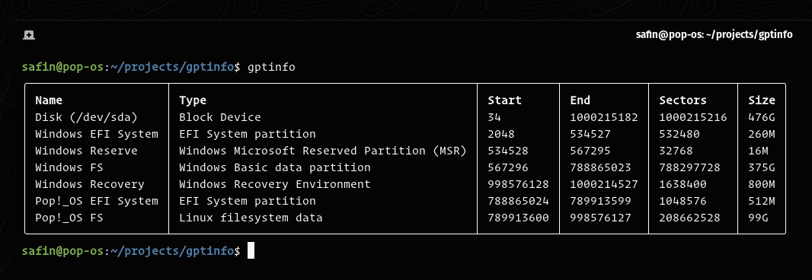

<h1 align="center">gptinfo</h1>

<p align="center">
    <i>A CLI tool to analyze partition tables</i>
    <hr />
</p>

## 🦀 Features

`gptinfo` is a command line tool to list partition tables on a block device for UEFI systems. It can:

- Display information in an `fdisk -l`-style table on a per-partition basis
  - Partition name (UTF-16, but coerced to UTF-8 for display purposes)
  - Device type based on its GUID
  - Start/End LBAs and total sector count
  - Partition size
- Display each partition's unqiue GUID (PARTUUID) given the `-g` flag

## ✨ In Action



## 📥 Installation

```sh
# install cargo through rustup
curl --proto '=https' --tlsv1.2 -sSf https://sh.rustup.rs | sh

# install crate
cargo install gptinfo
```

## 🛠️ Usage

```
$ gptinfo --help
gptinfo 1.0
Safin S. <safinsingh.dev@gmail.com>

USAGE:
    gptinfo [FLAGS] [OPTIONS]

FLAGS:
    -g, --guid       Show GUID of each partition
    -h, --help       Prints help information
    -V, --version    Prints version information

OPTIONS:
    -d, --device <device>    Block device to read GPT from [default: /dev/sda]
```

## 🔮 Contributing

If you feel like you can make a meaningful contribution to `gptinfo`, feel free to fork this repository and create a [pull request](https://github.com/safinsingh/gptinfo/pulls)! Feature requests and bugs can be filed on the [issues](https://github.com/safinsingh/gptinfo/issues) tab.

## 👨‍💻 Authors

- [Safin Singh](https://safin.dev)
